# Altora Pabrik - Ultimate Workflow

## Prinsip Produk

Altora Pabrik adalah control tower manufaktur ringan-menengah untuk usaha produksi makanan, minuman, frozen food, roti, konveksi, dan perakitan. Operator tidak mengisi jurnal atau tabel rumit: mereka hanya menjalankan pekerjaan hari ini, scan bahan, mencatat output, reject, dan masalah. Sistem menerjemahkannya menjadi stok, batch, biaya, approval, dan laporan owner.

## Objek Inti

| Objek | Fungsi |
| --- | --- |
| Produk jadi | Barang yang diproduksi dan dijual/dikirim. |
| Bahan baku | Material dengan satuan, supplier, lot, tanggal produksi/kedaluwarsa, dan titik reorder. |
| BOM/Formula | Versi resep/struktur material, yield, allowance waste, standar tenaga kerja, dan overhead. |
| Routing | Urutan proses, line/mesin, durasi standar, dan titik QC. |
| Work Order (WO) | Satu mandat produksi yang memiliki target, tanggal, shift, PIC, BOM versi, dan biaya aktual. |
| Batch | Identitas output produksi untuk traceability dari bahan ke barang jadi dan penjualan. |
| Quality Check | Pemeriksaan bahan masuk, in-process, dan produk jadi. |
| Mesin/Line | Kapasitas, status, jadwal maintenance, downtime, dan riwayat pemakaian. |
| Material Request | Permintaan bahan dari produksi ke gudang. |
| Stock Movement | Jejak bahan masuk, pindah, issue, return, konsumsi, waste, dan hasil produksi. |

## Alur End-to-End

```mermaid
flowchart LR
  A[Permintaan: sales forecast, pesanan, minimum stok] --> B[Planning produksi]
  B --> C[MRP: kebutuhan bahan dan kapasitas]
  C --> D{Bahan cukup?}
  D -->|Tidak| E[Purchase/transfer request + approval]
  D -->|Ya| F[Work Order dijadwalkan]
  E --> G[Penerimaan + QC bahan]
  G --> F
  F --> H[Gudang issue bahan ke WO]
  H --> I[Operator jalankan proses/routing]
  I --> J[QC in-process]
  J --> K[Output, waste, rework, downtime]
  K --> L[QC produk jadi + batch]
  L --> M{Lulus?}
  M -->|Ya| N[Barang jadi masuk stok siap jual]
  M -->|Hold/Reject| O[Quarantine, rework, disposal, investigasi]
  N --> P[Penjualan, delivery, atau transfer antar gudang]
  P --> Q[Costing aktual, laporan, penutupan WO]
```

## 1. Demand, Planning, dan MRP

Owner/planner membuka **Planning Produksi**. Sistem menggabungkan pesanan pelanggan, forecast berdasarkan penjualan, stok barang jadi, safety stock, WO yang masih berjalan, dan kapasitas mesin/shift. Planner memilih periode, lalu Altora menghasilkan saran produksi per produk.

Setelah saran disetujui, sistem membuat draft WO dan menghitung kebutuhan bahan berdasarkan BOM aktif, satuan konversi, yield, serta allowance waste. Kekurangan bahan otomatis membentuk Material Request; bila bahan tersedia di cabang/gudang lain, sistem menyarankan transfer sebelum pembelian.

## 2. Procurement dan Penerimaan Bahan

Material Request berubah menjadi Purchase Request/PO melalui approval sesuai nilai dan jenis bahan. Saat barang datang, petugas scan barcode/QR supplier atau input cepat, memilih lot, tanggal produksi, expired date, kuantitas aktual, dan lokasi simpan.

QC bahan wajib bila material ditandai kritis. Hasilnya: **Lulus** masuk stok tersedia, **Hold** masuk quarantine, **Tolak** membuat retur supplier. Harga beli memperbarui costing bahan dan seluruh pergerakan tercatat di kartu stok.

## 3. Setup Produk: BOM, Formula, dan Routing

Setiap produk jadi memiliki BOM berversi: bahan, satuan konversi, kuantitas standar, substitusi bahan yang diizinkan, yield, waste standar, dan biaya standar. BOM tidak boleh diubah untuk WO yang sudah berjalan; perubahan membuat versi baru agar histori produksi tetap akurat.

Routing mendefinisikan proses seperti timbang, mixing, baking, cooling, packing atau cutting, sewing, QC, packing. Tiap langkah memiliki line/mesin, estimasi durasi, instruksi kerja, parameter wajib, dan checkpoint QC.

## 4. Work Order dan Material Issue

Supervisor menjadwalkan WO ke outlet/pabrik, line, mesin, shift, dan PIC. Statusnya: **Draft → Menunggu Bahan → Dijadwalkan → Berjalan → Menunggu QC → Selesai / Ditutup / Dibatalkan**.

Gudang menerima daftar pick bahan per WO. Petugas scan lot bahan saat issue; Altora menerapkan FEFO untuk bahan ber-expired dan memperingatkan bila lot hampir kedaluwarsa atau bukan bahan yang disetujui. Bahan yang tidak habis dapat dikembalikan dengan scan ke gudang. Selisih issue, return, dan konsumsi wajib diberi alasan.

## 5. Layar Operator: Sederhana dan Tahan Lapangan

Halaman **Lantai Produksi** hanya berisi WO shift ini. Operator menekan mulai, melihat urutan proses, scan bahan, input parameter (contoh suhu, berat, waktu), input output, reject, dan foto bukti bila diperlukan. Tidak ada menu finance atau konfigurasi di layar ini.

Progress dihitung otomatis dari routing dan output aktual. Operator dapat melaporkan stop mesin, bahan kurang, kualitas tidak sesuai, atau kebutuhan bantuan; laporan tersebut langsung menjadi exception untuk supervisor, bukan pesan WhatsApp yang hilang.

## 6. QC, Batch, Rework, dan Traceability

QC dilakukan pada tiga titik: bahan masuk, proses, dan produk jadi. Produk jadi selalu membentuk batch berisi nomor batch, WO, BOM versi, line/mesin, shift, operator, tanggal produksi, expired date, dan hasil QC.

Batch **Lulus** masuk stok siap jual, **Hold** masuk lokasi quarantine, dan **Reject** harus dipilih tindakannya: rework, downgrade, return, atau disposal. Rework membuat WO turunan agar bahan/biaya/hasilnya tidak hilang.

Traceability harus dapat menjawab dua arah dalam satu layar:

- Dari batch barang jadi: bahan lot apa, supplier siapa, operator/mesin/WO mana, dan dijual ke transaksi mana.
- Dari bahan lot bermasalah: batch produk jadi mana yang terdampak, masih ada di gudang/cabang mana, dan transaksi pelanggan mana yang perlu ditelusuri.

## 7. Mesin, Downtime, dan Maintenance

Mesin/line memiliki kapasitas, jam kerja, status, jadwal preventive maintenance, sparepart, dan log perbaikan. Saat operator melaporkan downtime pada WO, sistem mencatat mesin, alasan, durasi, dampak target, dan notifikasi supervisor.

WO tidak dapat dijadwalkan ke mesin yang statusnya rusak/maintenance. Biaya maintenance dapat dibebankan sebagai overhead pabrik atau biaya operasional sesuai pengaturan owner.

## 8. Costing dan Finance Otomatis

Saat WO selesai, Altora menghitung biaya aktual dari lot bahan yang benar-benar dikonsumsi, tenaga kerja per shift/jam, penggunaan mesin/overhead, waste, dan rework. Sistem membandingkan HPP standar vs aktual, menjelaskan variance bahan/harga/yield/waste, dan memperbarui nilai stok barang jadi.

Owner hanya melihat ringkasan yang dapat ditindaklanjuti: biaya melonjak, yield turun, waste melewati ambang, atau WO terlambat. Akuntan dapat melihat jurnal otomatis, persediaan WIP, COGS, dan biaya overhead tanpa meminta operator input ulang.

## 9. Exception Center

Dashboard produksi tidak boleh hanya menampilkan KPI. Bagian pertama adalah antrean tindakan:

1. Bahan kritis sebelum WO mulai.
2. WO terlambat atau kapasitas line penuh.
3. Batch Hold/Reject yang belum diputuskan.
4. Downtime mesin aktif.
5. Yield/waste di luar standar.
6. Expiry bahan atau barang jadi mendekat.
7. Selisih stok hasil opname.

Setiap exception memiliki owner, deadline, tindakan berikutnya, dan riwayat keputusan/approval.

## 10. Menu Berdasarkan Peran

| Peran | Menu utama |
| --- | --- |
| Owner | Command Center, profitabilitas, exception, approval besar, laporan. |
| Planner | Planning produksi, forecast, MRP, kapasitas, WO draft. |
| Supervisor | Jadwal/assign WO, monitor lantai produksi, exception, QC escalation. |
| Gudang | Penerimaan, QC bahan, putaway, material issue/return, transfer. |
| Operator | Lantai Produksi: WO shift ini, proses, output, reject, downtime. |
| QC | Queue inspeksi, hold/release/reject, checklist, COA/foto. |
| Maintenance | Mesin, preventive plan, ticket, sparepart, downtime. |
| Finance | Costing, variance, WIP, jurnal, laporan. |

## 11. Screen Utama

1. Command Center Pabrik.
2. Planning dan MRP.
3. BOM/Formula dan Routing.
4. Work Order Board.
5. Lantai Produksi (tablet/mobile).
6. Gudang Produksi: receiving, QC, issue, return, transfer.
7. QC dan Batch Traceability.
8. Mesin dan Maintenance.
9. Costing dan Variance.
10. Recall/Quarantine Center.
11. Laporan Produksi.

## Guardrail Wajib

- Tidak boleh konsumsi bahan tanpa WO dan lot yang jelas.
- Tidak boleh menjual batch Hold/Reject.
- Tidak boleh mengubah BOM versi pada WO berjalan.
- Tidak boleh menutup WO dengan output/waste kosong tanpa alasan.
- Semua koreksi stok, QC override, dan costing adjustment membutuhkan alasan serta audit log.
- Approval nilai tinggi, disposal, dan perubahan BOM mengikuti hirarki yang bisa diatur tiap tenant.

## Definition of Done

Altora Pabrik dianggap siap bila satu produk dapat direncanakan, bahan dibeli/diterima/QC, WO dijalankan per shift, material dan output dipindai per batch, quality result menentukan stok siap jual, biaya aktual terbentuk otomatis, dan owner dapat menelusuri satu batch dari supplier sampai transaksi penjualan tanpa spreadsheet.
