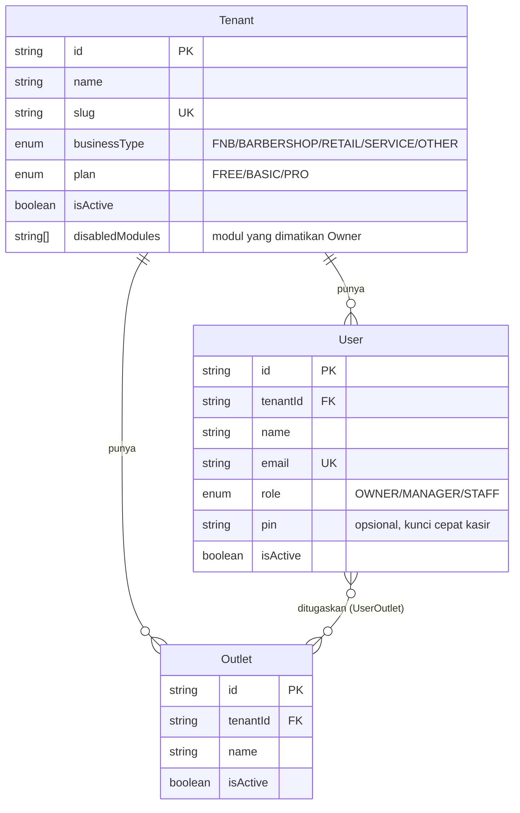
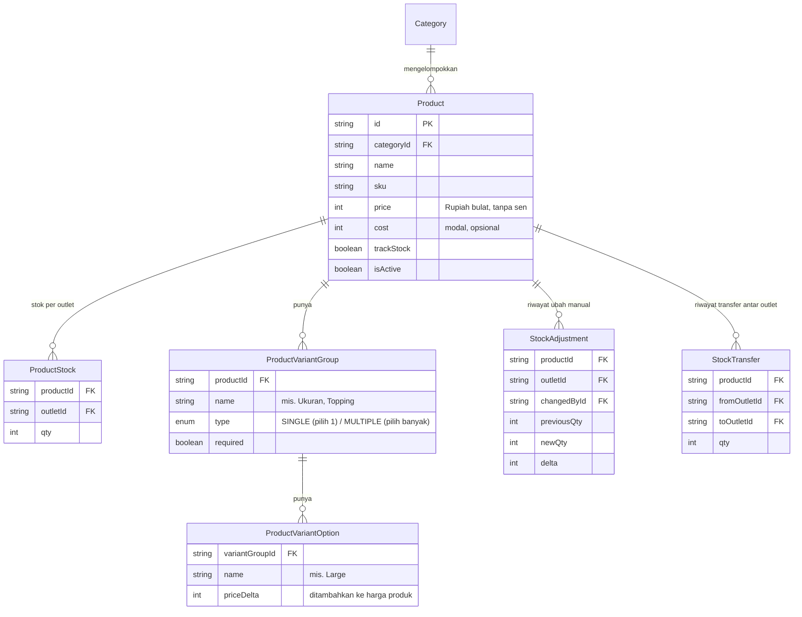
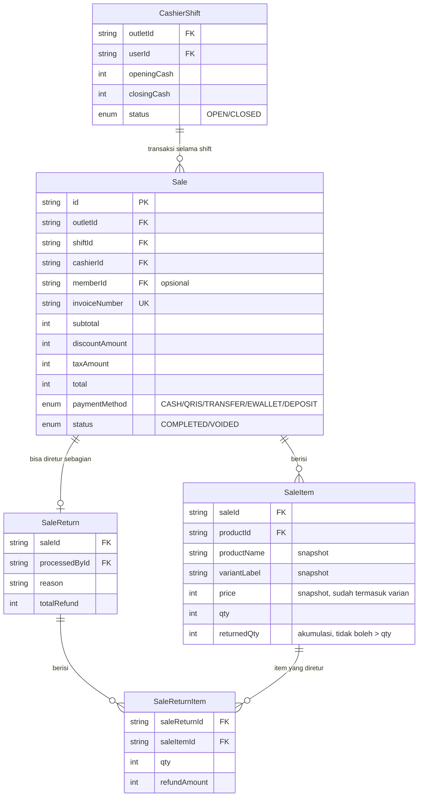
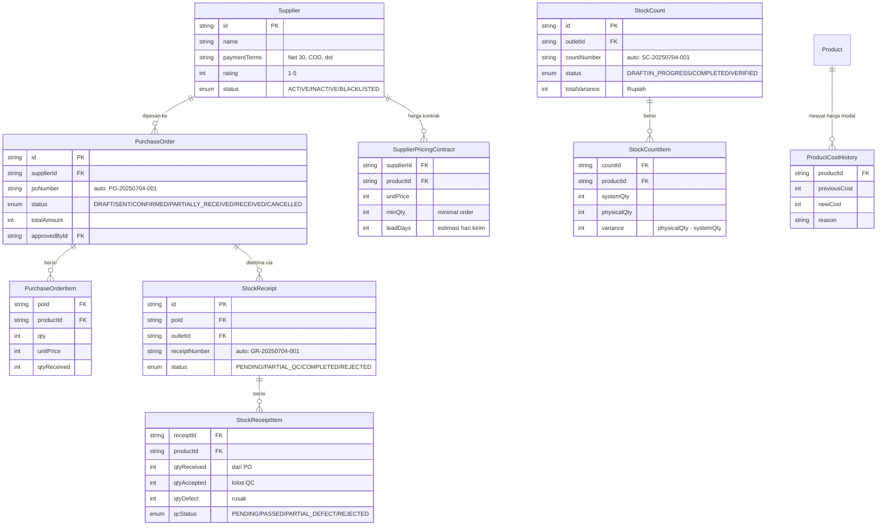
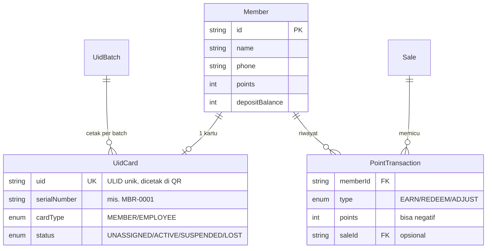
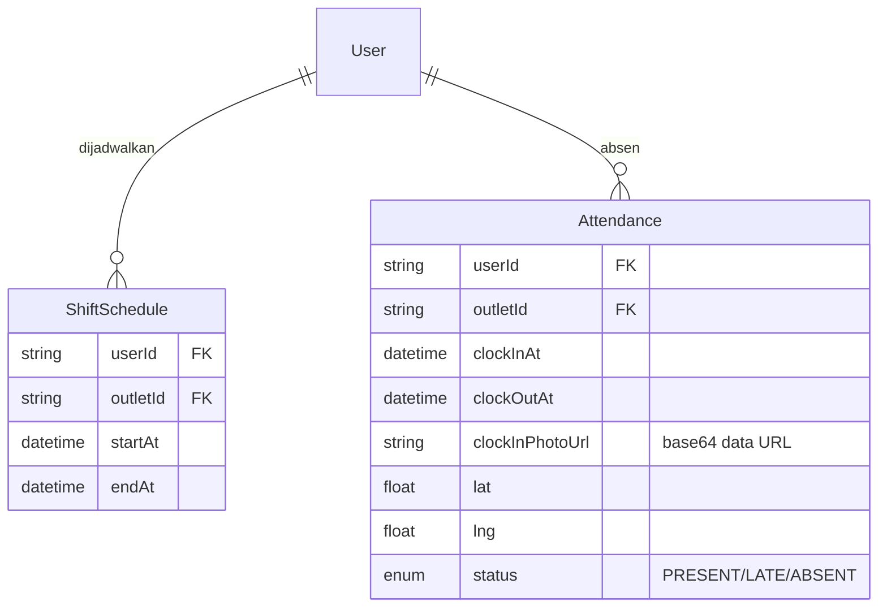
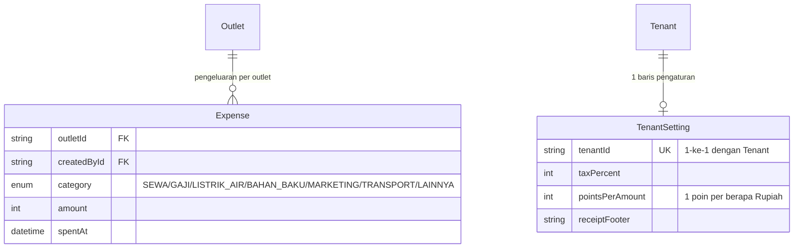
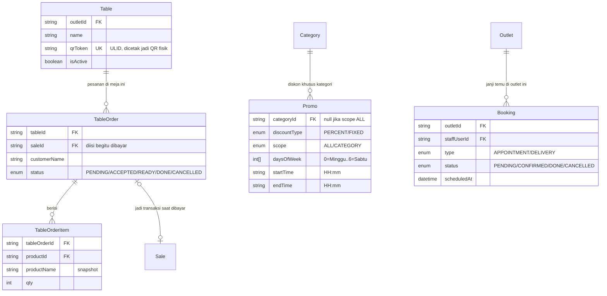
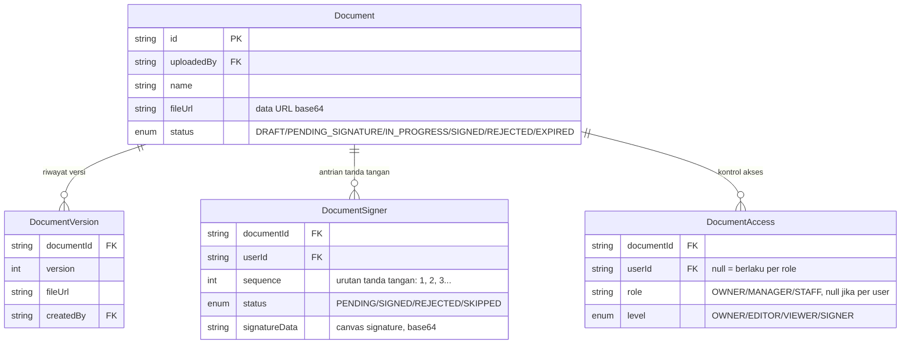
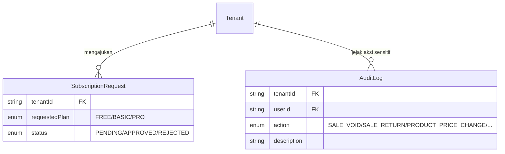

# Skema Database

Dokumen ini menjelaskan seluruh model data di `prisma/schema.prisma`,
dikelompokkan per domain bisnis supaya lebih mudah dipahami daripada
membaca 1300+ baris schema mentah. Untuk field & relasi yang presisi
(nullable, default value, index), **schema.prisma tetap sumber kebenaran
satu-satunya** — dokumen ini adalah peta untuk menavigasinya, bukan
pengganti.

> Semua model (kecuali `SuperAdmin`) punya kolom `tenantId` dan di-`@@index`
> berdasarkan itu. Ini bukan kebetulan — lihat [ARSITEKTUR.md § Isolasi
> multi-tenant](./ARSITEKTUR.md#isolasi-multi-tenant) untuk kenapa ini aturan
> yang tidak boleh dilanggar.

## Daftar isi

1. [Inti: Tenant, Outlet, User](#1-inti-tenant-outlet-user)
2. [Kasir, Produk & Stok](#2-kasir-produk--stok)
3. [Penjualan & Retur](#3-penjualan--retur)
4. [Pembelian & Penerimaan Barang (Procurement)](#4-pembelian--penerimaan-barang-procurement)
5. [Member & Loyalitas](#5-member--loyalitas)
6. [Tim: Jadwal & Absensi](#6-tim-jadwal--absensi)
7. [Finance: Pengeluaran & Pengaturan](#7-finance-pengeluaran--pengaturan)
8. [Pesanan Digital: Meja QR, Promo, Booking](#8-pesanan-digital-meja-qr-promo-booking)
9. [Dokumen & E-Sign](#9-dokumen--e-sign)
10. [Platform: Super Admin, Langganan, Audit Log](#10-platform-super-admin-langganan-audit-log)

---

## 1. Inti: Tenant, Outlet, User

Fondasi multi-tenant. Setiap bisnis yang daftar = 1 `Tenant`. Satu tenant
bisa punya banyak `Outlet` (cabang) dan banyak `User` (karyawan). Seorang
`User` bisa ditugaskan ke beberapa outlet lewat tabel penghubung
`UserOutlet` (many-to-many) — Owner terkecuali, dia otomatis punya akses
ke semua outlet tenant-nya tanpa perlu baris `UserOutlet`.

**Poin penting:**
- `Tenant.isActive` dicek di **setiap request** lewat `requireSession()`
  (bukan cuma saat login) — kalau super-admin men-suspend tenant, akses
  langsung terputus walau JWT sesi masih berlaku.
- `Tenant.disabledModules` adalah daftar key modul yang dimatikan Owner
  (lihat [ARSITEKTUR.md § Sistem Modul](./ARSITEKTUR.md#sistem-modul)).
  Modul `kasir` tidak pernah bisa masuk sini — dia "core", selalu aktif.
- `User.role` menentukan apa yang bisa diakses (lihat tabel peran & akses
  di README) — dicek server-side lewat `requireRole()`, bukan cuma
  disembunyikan di UI.

---

## 2. Kasir, Produk & Stok

**Poin penting:**
- **Uang selalu `Int` Rupiah bulat**, tidak pernah desimal/float — satu
  konvensi yang dipegang konsisten di seluruh schema untuk semua kolom
  harga/nominal. Format tampilannya selalu lewat `formatRupiah()` di
  `src/lib/format.ts`.
- `ProductStock` itu **stok per kombinasi produk+outlet** (`@@unique([productId, outletId])`)
  — produk yang sama bisa punya angka stok berbeda di tiap cabang.
- `StockAdjustment` cuma mencatat perubahan **manual** lewat halaman
  Produk. Perubahan stok otomatis dari transaksi penjualan/void/retur
  TIDAK masuk sini — itu sudah punya jejaknya sendiri lewat relasi
  `Sale`/`SaleReturn`.
- `ProductVariantGroup`/`Option` = varian & topping (mis. Ukuran,
  Level Gula, Topping). Pilihan varian di-snapshot sebagai teks
  (`variantLabel`) di `SaleItem` saat transaksi, jadi kalau varian
  produknya diubah/dihapus di kemudian hari, struk transaksi lama tidak
  ikut berubah.

Model lanjutan yang skema-nya sudah ada tapi belum ada UI/servicenya
sepenuhnya terpakai di produk: `StockReorderPoint` (ambang minimal stok
sebelum warning), `StockBatch` (lot/batch tracking + tanggal kedaluwarsa,
untuk FMCG/makanan/farmasi), `WarehouseLocation` (lokasi rak fisik).

---

## 3. Penjualan & Retur

**Poin penting — beda Void vs Retur (sering disalahpahami):**
- **Void** (`Sale.status = VOIDED`) membatalkan **seluruh** transaksi.
- **Retur** (`SaleReturn`) membatalkan **sebagian item** dari transaksi
  yang statusnya tetap `COMPLETED`. Satu `Sale` bisa punya beberapa
  `SaleReturn` (retur bertahap), tapi total qty yang diretur per
  `SaleItem` tidak boleh melebihi `qty` aslinya (`returnedQty` sebagai
  penjaga).
- Retur otomatis mengembalikan stok produk dan mengoreksi poin member
  secara proporsional — dilakukan di service layer (`sale-service.ts`),
  bukan trigger database.

`Sale.shiftId` nullable karena transaksi dari **Pesanan Meja QR** (lihat
§8) tidak selalu terjadi dalam konteks shift kasir yang sedang berjalan.

---

## 4. Pembelian & Penerimaan Barang (Procurement)

Alur lengkap dari pesan ke supplier sampai stok masuk & opname fisik —
4 tahap berurutan: **Supplier → PurchaseOrder → StockReceipt (dengan QC)
→ StockCount**.

**Alur status & kenapa dipecah jadi 4 model terpisah:**

1. **Supplier** — data vendor + `SupplierPricingContract` (harga khusus
   per produk per supplier, dengan minimal order quantity).
2. **PurchaseOrder** — pesanan dibuat `DRAFT` → di-approve (`SENT`) →
   dikonfirmasi supplier (`CONFIRMED`) → barang datang (`RECEIVED`/
   `PARTIALLY_RECEIVED` kalau cuma sebagian). `approvedById` mencatat
   siapa yang menyetujui.
3. **StockReceipt** — dibuat saat barang fisik tiba di outlet, **belum**
   otomatis nambah stok. Tiap item punya alur **Quality Control**
   (`qcStatus`) sendiri: barang diperiksa, jumlah yang lolos QC
   (`qtyAccepted`) vs rusak (`qtyDefect`) dicatat terpisah. Stok baru
   benar-benar bertambah ketika status jadi `COMPLETED`.
4. **StockCount** — opname fisik berkala, independen dari alur
   pembelian. Membandingkan `systemQty` (apa yang tercatat sistem) vs
   `physicalQty` (hasil hitung manual), menghasilkan `variance`. Butuh
   `VERIFIED` oleh Owner/Manager sebelum selisihnya benar-benar
   mengoreksi `ProductStock`.
5. **ProductCostHistory** — jejak audit tiap kali harga modal (`cost`)
   produk berubah, biasanya dipicu perubahan harga dari supplier.

> Fitur ini termasuk modul **Kasir & Produk** (core, selalu aktif) dan
> tampil di hub **Kasir**, khusus role Owner/Manager.

---

## 5. Member & Loyalitas

**Poin penting:**
- `UidCard` dipakai untuk **dua jenis kartu** (`cardType`): member
  pelanggan ATAU kartu karyawan (`EmployeeCard`) — satu sistem generate
  QR/ULID dipakai ulang untuk dua kebutuhan berbeda.
- Halaman publik `/q/[uid]` (tanpa login) me-resolve `uid` → `Member`
  untuk portal pelanggan lihat poin/saldo/riwayat sendiri. Ini salah
  satu dari dua pengecualian terdokumentasi yang boleh menurunkan
  `tenantId` dari record hasil resolve token, bukan dari sesi login
  (lihat [ARSITEKTUR.md](./ARSITEKTUR.md)).
- `Member.depositBalance` bisa dipakai sebagai `PaymentMethod.DEPOSIT`
  saat checkout di Kasir.

---

## 6. Tim: Jadwal & Absensi

**Poin penting:**
- `Attendance.status` dihitung **otomatis saat clock-in**: kalau ada
  `ShiftSchedule` untuk hari itu dan jam clock-in melewati toleransi
  (grace period 15 menit), statusnya `LATE`, kalau tidak `PRESENT`.
  Analitik ketepatan waktu di hub Tim membaca kolom ini langsung, tidak
  menghitung ulang dari jadwal setiap kali.
- Foto clock-in (`clockInPhotoUrl`) disimpan sebagai **data URL base64
  langsung di kolom**, dikompresi dulu di sisi client — bukan diunggah
  ke object storage terpisah. Pola yang sama dipakai ulang untuk
  `Document.fileUrl` (lihat §9).

---

## 7. Finance: Pengeluaran & Pengaturan

`Expense` dipakai untuk menghitung **untung bersih** di Laporan (omzet
dikurangi pengeluaran operasional), terpisah dari `cost` produk yang
menghitung **untung kotor**.

---

## 8. Pesanan Digital: Meja QR, Promo, Booking

**Poin penting — yang paling gampang disalahpahami di sistem ini:**
- **Stok direservasi SAAT pesanan dibuat**, bukan saat dibayar. Kalau
  dua meja pesan produk yang sama persis di detik yang sama dan stoknya
  cuma cukup untuk satu, sistem menjamin cuma satu yang lolos (atomik di
  level query) — mencegah race condition oversell.
- Satu `TableOrder` menampung **banyak ronde pesanan** sebelum dibayar
  (open bill) — pelanggan bisa pesan berkali-kali, staff baru bikin
  `Sale` sekali di akhir dari akumulasi `TableOrderItem`, **tanpa**
  memotong stok kedua kalinya (sudah direservasi di awal).
- `Table.qrToken` — sama seperti `UidCard.uid`, ini token publik yang
  MENURUNKAN `tenantId`, bukan menerimanya dari input. Endpoint publik
  `/pesan/[qrToken]` resolve meja dari token ini saja.
- `Promo` **tidak perlu diinput manual** oleh kasir — dievaluasi otomatis
  dari waktu server tiap kali halaman Kasir dibuka (`daysOfWeek` +
  `startTime`/`endTime` cocok dengan sekarang → otomatis aktif, diskon
  terbesar yang dipakai kalau ada beberapa yang cocok, tidak ditumpuk).
- `Booking` **tidak** punya halaman self-service publik — selalu dicatat
  staff (mis. saat pelanggan telepon).

---

## 9. Dokumen & E-Sign

**Poin penting:**
- `Document.fileUrl` dan `DocumentVersion.fileUrl` disimpan sebagai
  **data URL base64 langsung di kolom TEXT** — pola yang sama dengan
  foto absensi (§6), bukan diunggah ke object storage (Supabase Storage,
  S3, dst). Ini pilihan sadar untuk menghindari setup infrastruktur
  tambahan; batas ukuran file diberlakukan di server action (8MB) supaya
  tidak membebani database. Kalau ke depan volume dokumen membesar,
  ini kandidat pertama untuk dipindah ke object storage sungguhan.
- **Tanda tangan berurutan** (`DocumentSigner.sequence`): penandatangan
  ditentukan manual oleh pembuat dokumen saat upload, urutannya wajib
  (signer #2 baru bisa tanda tangan setelah #1 selesai — dicek di
  `e-sign-service.ts`, bukan di UI saja).
- `DocumentAccess` bisa menyasar **user tertentu** ATAU **seluruh role**
  (mis. semua MANAGER) — `userId` dan `role` saling eksklusif, salah
  satunya `null`.
- Fitur ini **standalone**, tidak terikat modul mana pun — muncul di
  sidebar semua hub (lihat [ARSITEKTUR.md § Sistem Hub](./ARSITEKTUR.md#sistem-hub)).

---

## 10. Platform: Super Admin, Langganan, Audit Log

**Poin penting:**
- `SuperAdmin` **satu-satunya model tanpa `tenantId`** — ini akun
  pemilik platform (Altora), sesinya terpisah total dari NextAuth (lihat
  `src/lib/super-admin-session.ts`) supaya tidak mungkin tertukar dengan
  sesi tenant biasa.
- Upgrade paket **tidak otomatis** — Owner mengajukan lewat Pengaturan →
  Langganan, pembayaran ditransfer manual, super-admin memverifikasi &
  approve dari panel `/superadmin`, baru `Tenant.plan` berubah.
- `AuditLog` cuma mencatat aksi yang **berdampak ke uang/data** (lihat
  enum `AuditAction`) — bukan log aktivitas umum seperti "user login" atau
  "buka halaman X".
