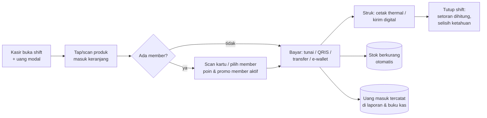
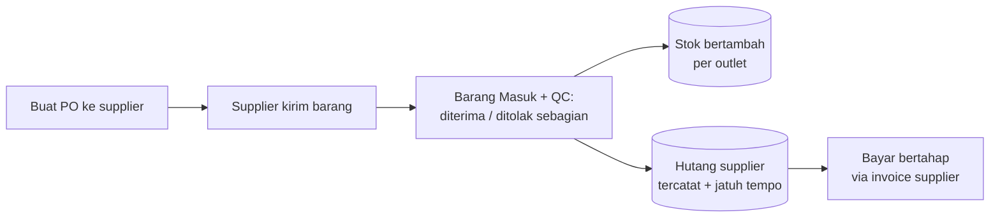
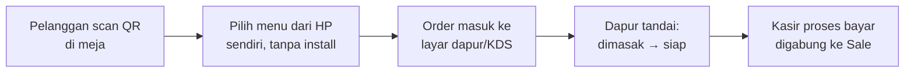
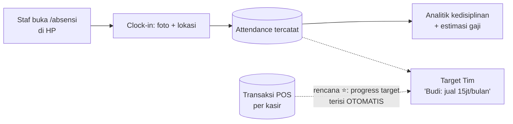
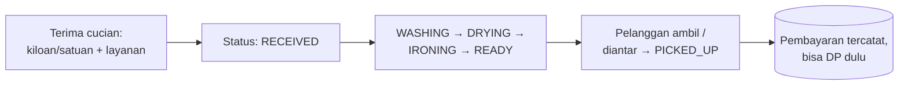
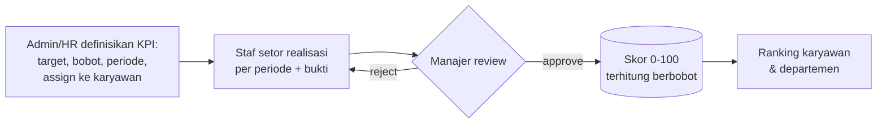
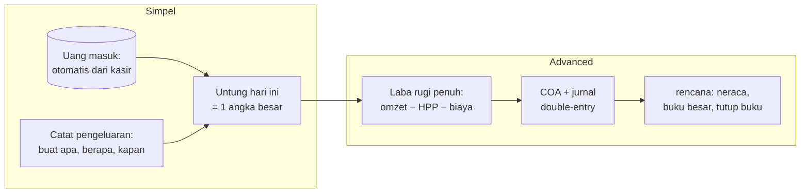

# Alur Kerja Utama

> Ditulis manual (bukan digenerate) — update kalau alur bisnisnya berubah.
> Diagram dirender otomatis oleh GitHub (Mermaid).

## 1. Alur Penjualan Kasir

Model terkait: `CashierShift → Sale → SaleItem` · stok: `ProductStock` · uang: laporan omzet + `CashFlow`.

## 2. Alur Stok Masuk (Advanced)

Model: `PurchaseOrder → StockReceipt(+Item QC) → ProductStock` · hutang: `SupplierInvoice → SupplierPayment`.

## 3. Alur Pesan QR Meja (Cafe)

Model: `Table(qrToken) → TableOrder(+Item) → Sale`. Halaman publik: `/pesan/[qrToken]` (tanpa login, tenant di-resolve dari token).

## 4. Alur Absensi & (rencana) Target Tim

Model: `ShiftSchedule`, `Attendance` · rencana: model Target (lihat MASTER-GUIDELINE §4 Tim).

## 5. Alur Laundry

Model: `LaundryService` (definisi layanan) → `LaundryOrder` (status berjalan).

## 6. Alur KPI Advanced (rencana — migrasi dari svt-kpi-monitor)

Hanya muncul di mode **Advanced** / produk HRIS. Versi Simpel-nya = Target Tim (alur #4).

## 7. Alur Uang (dua versi)

Toggle: `TenantSetting.accountingMode` (SIMPLE/ADVANCED) — pola acuan untuk semua toggle versi.
