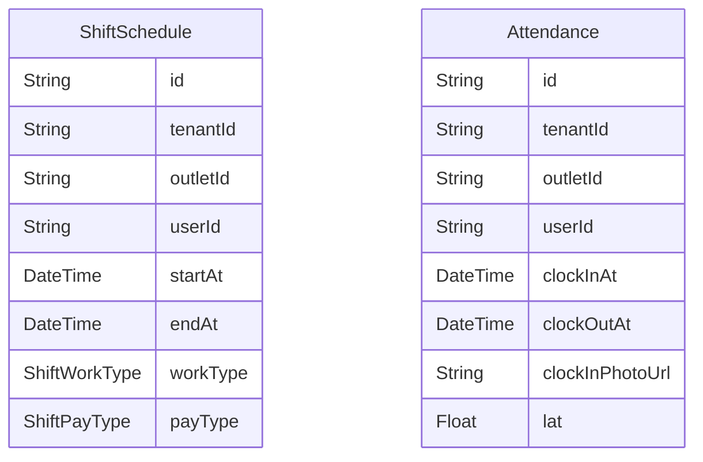

# Domain: ABSENSI & JADWAL

> Digenerate otomatis dari `prisma/schema.prisma` — jangan edit manual, jalankan `npm run knowledge`.

Model: `ShiftSchedule`, `Attendance`

## Relasi keluar domain

- `Tenant` → `ShiftSchedule` (`shiftSchedules`, 1-N)
- `Tenant` → `Attendance` (`attendances`, 1-N)
- `Outlet` → `ShiftSchedule` (`shiftSchedules`, 1-N)
- `Outlet` → `Attendance` (`attendances`, 1-N)
- `User` → `Attendance` (`attendances`, 1-N)
- `User` → `ShiftSchedule` (`shiftSchedules`, 1-N)
