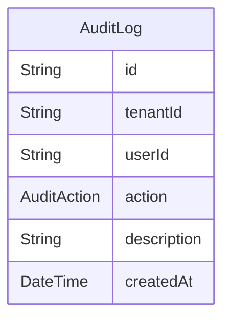

# Domain: AUDIT LOG

> Digenerate otomatis dari `prisma/schema.prisma` — jangan edit manual, jalankan `npm run knowledge`.

Model: `AuditLog`

## Relasi keluar domain

- `Tenant` → `AuditLog` (`auditLogs`, 1-N)
- `User` → `AuditLog` (`auditLogs`, 1-N)
