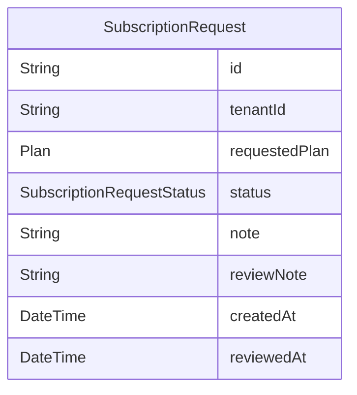

# Domain: BILLING & LANGGANAN

> Digenerate otomatis dari `prisma/schema.prisma` — jangan edit manual, jalankan `npm run knowledge`.

Model: `SubscriptionRequest`

## Relasi keluar domain

- `Tenant` → `SubscriptionRequest` (`subscriptionRequests`, 1-N)
