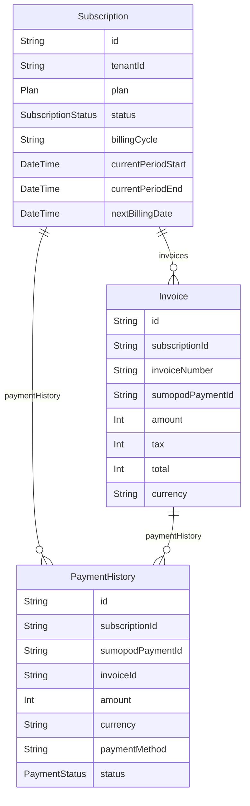

# Domain: BILLING & SUBSCRIPTION (SUMOPOD)

> Digenerate otomatis dari `prisma/schema.prisma` — jangan edit manual, jalankan `npm run knowledge`.

Model: `Subscription`, `Invoice`, `PaymentHistory`

## Relasi keluar domain

- `Subscription` → `Tenant` (`subscription`, 1-1?)
