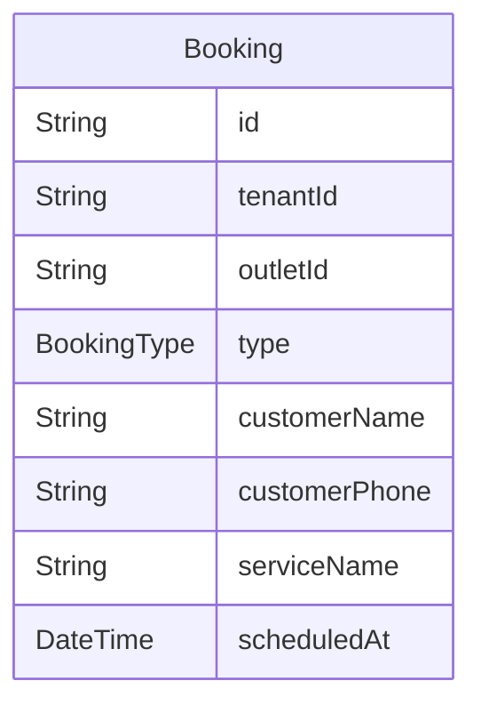

# Domain: BOOKING / APPOINTMENT

> Digenerate otomatis dari `prisma/schema.prisma` — jangan edit manual, jalankan `npm run knowledge`.

Model: `Booking`

## Relasi keluar domain

- `Tenant` → `Booking` (`bookings`, 1-N)
- `Outlet` → `Booking` (`bookings`, 1-N)
- `User` → `Booking` (`bookingsAssigned`, 1-N)
- `Booking` → `Sale` (`sales`, 1-N)
