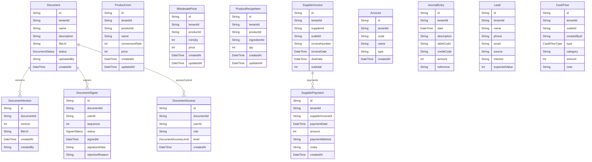

# Domain: DOKUMEN & E-SIGN

> Digenerate otomatis dari `prisma/schema.prisma` — jangan edit manual, jalankan `npm run knowledge`.

Model: `Document`, `DocumentVersion`, `DocumentSigner`, `DocumentAccess`, `ProductUom`, `WholesalePrice`, `ProductRecipeItem`, `SupplierInvoice`, `SupplierPayment`, `Account`, `JournalEntry`, `Lead`, `CashFlow`

## Relasi keluar domain

- `Tenant` → `Document` (`documents`, 1-N)
- `Tenant` → `ProductUom` (`productUoms`, 1-N)
- `Tenant` → `WholesalePrice` (`wholesalePrices`, 1-N)
- `Tenant` → `ProductRecipeItem` (`productRecipeItems`, 1-N)
- `Tenant` → `SupplierInvoice` (`supplierInvoices`, 1-N)
- `Tenant` → `SupplierPayment` (`supplierPayments`, 1-N)
- `Tenant` → `Account` (`accounts`, 1-N)
- `Tenant` → `JournalEntry` (`journalEntries`, 1-N)
- `Tenant` → `Lead` (`leads`, 1-N)
- `Tenant` → `CashFlow` (`cashFlows`, 1-N)
- `Outlet` → `CashFlow` (`cashFlows`, 1-N)
- `User` → `Document` (`documentsUploaded`, 1-N)
- `User` → `DocumentVersion` (`documentVersions`, 1-N)
- `User` → `DocumentSigner` (`documentSignings`, 1-N)
- `User` → `DocumentAccess` (`documentAccess`, 1-N)
- `User` → `CashFlow` (`cashFlowsCreated`, 1-N)
- `Product` → `ProductUom` (`uoms`, 1-N)
- `Product` → `WholesalePrice` (`wholesalePrices`, 1-N)
- `Product` → `ProductRecipeItem` (`recipes`, 1-N)
- `Supplier` → `SupplierInvoice` (`invoices`, 1-N)
