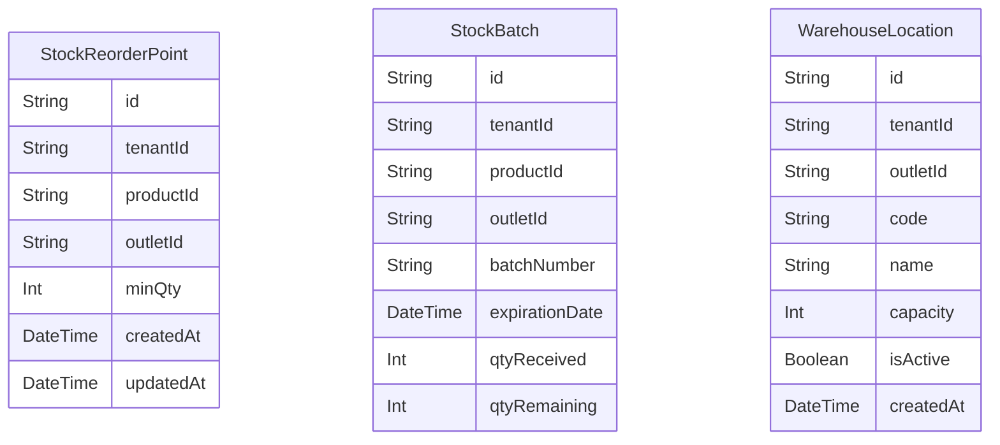

# Domain: INVENTORY ENHANCEMENTS

> Digenerate otomatis dari `prisma/schema.prisma` — jangan edit manual, jalankan `npm run knowledge`.

Model: `StockReorderPoint`, `StockBatch`, `WarehouseLocation`

## Relasi keluar domain

- `Tenant` → `StockReorderPoint` (`reorderPoints`, 1-N)
- `Tenant` → `StockBatch` (`stockBatches`, 1-N)
- `Tenant` → `WarehouseLocation` (`warehouseLocations`, 1-N)
- `Outlet` → `StockReorderPoint` (`reorderPoints`, 1-N)
- `Outlet` → `StockBatch` (`stockBatches`, 1-N)
- `Outlet` → `WarehouseLocation` (`warehouseLocations`, 1-N)
- `Product` → `StockReorderPoint` (`reorderPoints`, 1-N)
- `Product` → `StockBatch` (`stockBatches`, 1-N)
