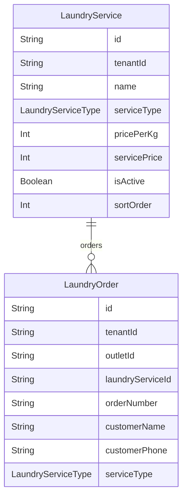

# Domain: LAUNDRY

> Digenerate otomatis dari `prisma/schema.prisma` — jangan edit manual, jalankan `npm run knowledge`.

Model: `LaundryOrder`, `LaundryService`

## Relasi keluar domain

- `Tenant` → `LaundryOrder` (`laundryOrders`, 1-N)
- `Tenant` → `LaundryService` (`laundryServices`, 1-N)
- `Outlet` → `LaundryOrder` (`laundryOrders`, 1-N)
- `User` → `LaundryOrder` (`laundryOrdersCreated`, 1-N)
