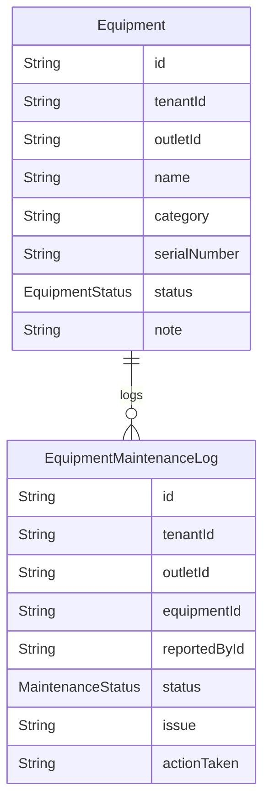

# Domain: MAINTENANCE ALAT

> Digenerate otomatis dari `prisma/schema.prisma` — jangan edit manual, jalankan `npm run knowledge`.

Model: `Equipment`, `EquipmentMaintenanceLog`

## Relasi keluar domain

- `Tenant` → `Equipment` (`equipments`, 1-N)
- `Tenant` → `EquipmentMaintenanceLog` (`equipmentMaintenanceLogs`, 1-N)
- `Outlet` → `Equipment` (`equipments`, 1-N)
- `Outlet` → `EquipmentMaintenanceLog` (`equipmentMaintenanceLogs`, 1-N)
- `User` → `EquipmentMaintenanceLog` (`equipmentMaintenanceLogs`, 1-N)
