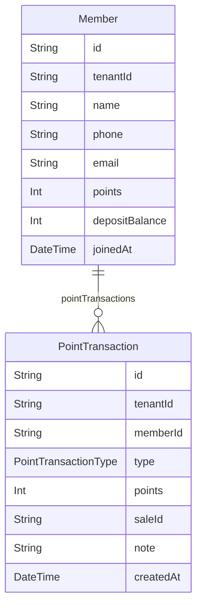

# Domain: MEMBER

> Digenerate otomatis dari `prisma/schema.prisma` — jangan edit manual, jalankan `npm run knowledge`.

Model: `Member`, `PointTransaction`

## Relasi keluar domain

- `Tenant` → `Member` (`members`, 1-N)
- `Tenant` → `PointTransaction` (`pointTransactions`, 1-N)
- `Member` → `UidCard` (`member`, 1-1?)
- `Member` → `Sale` (`sales`, 1-N)
- `Sale` → `PointTransaction` (`pointTransactions`, 1-N)
