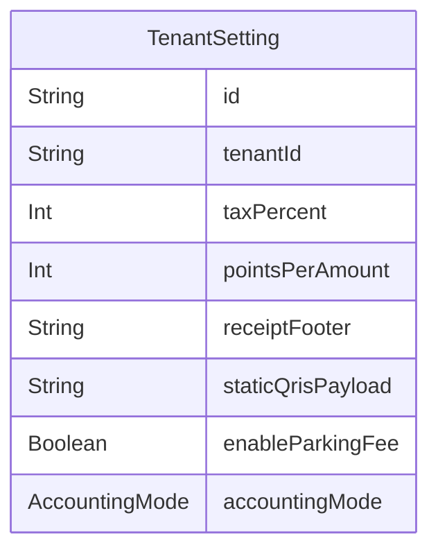

# Domain: PENGATURAN TENANT

> Digenerate otomatis dari `prisma/schema.prisma` — jangan edit manual, jalankan `npm run knowledge`.

Model: `TenantSetting`

## Relasi keluar domain

- `TenantSetting` → `Tenant` (`setting`, 1-1?)
