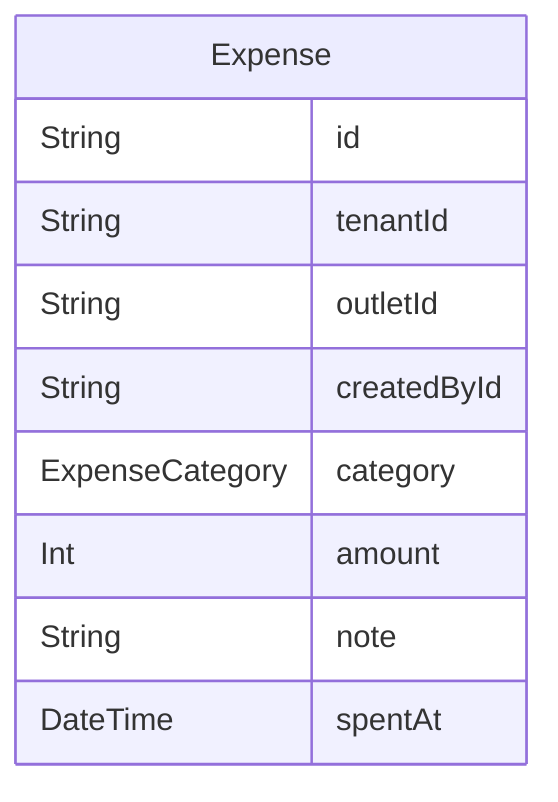

# Domain: PENGELUARAN OPERASIONAL

> Digenerate otomatis dari `prisma/schema.prisma` — jangan edit manual, jalankan `npm run knowledge`.

Model: `Expense`

## Relasi keluar domain

- `Tenant` → `Expense` (`expenses`, 1-N)
- `Outlet` → `Expense` (`expenses`, 1-N)
- `User` → `Expense` (`expensesCreated`, 1-N)
