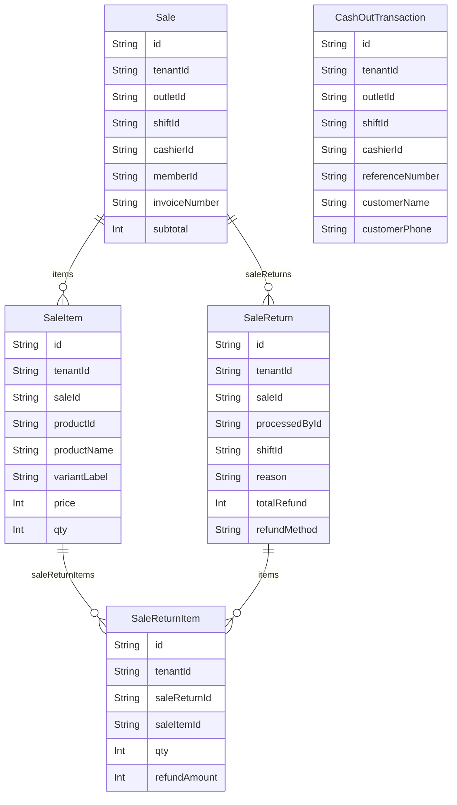

# Domain: PENJUALAN

> Digenerate otomatis dari `prisma/schema.prisma` — jangan edit manual, jalankan `npm run knowledge`.

Model: `Sale`, `CashOutTransaction`, `SaleItem`, `SaleReturn`, `SaleReturnItem`

## Relasi keluar domain

- `Tenant` → `Sale` (`sales`, 1-N)
- `Tenant` → `CashOutTransaction` (`cashOutTransactions`, 1-N)
- `Tenant` → `SaleItem` (`saleItems`, 1-N)
- `Tenant` → `SaleReturn` (`saleReturns`, 1-N)
- `Tenant` → `SaleReturnItem` (`saleReturnItems`, 1-N)
- `Outlet` → `Sale` (`sales`, 1-N)
- `Outlet` → `CashOutTransaction` (`cashOutTransactions`, 1-N)
- `User` → `Sale` (`salesAsCashier`, 1-N)
- `User` → `CashOutTransaction` (`cashOutTransactions`, 1-N)
- `User` → `SaleReturn` (`saleReturnsProcessed`, 1-N)
- `Member` → `Sale` (`sales`, 1-N)
- `Product` → `SaleItem` (`saleItems`, 1-N)
- `CashierShift` → `Sale` (`sales`, 1-N)
- `CashierShift` → `CashOutTransaction` (`cashOutTransactions`, 1-N)
- `CashierShift` → `SaleReturn` (`saleReturns`, 1-N)
- `Sale` → `PointTransaction` (`pointTransactions`, 1-N)
- `TableOrder` → `Sale` (`tableOrder`, 1-1?)
- `Booking` → `Sale` (`sales`, 1-N)
