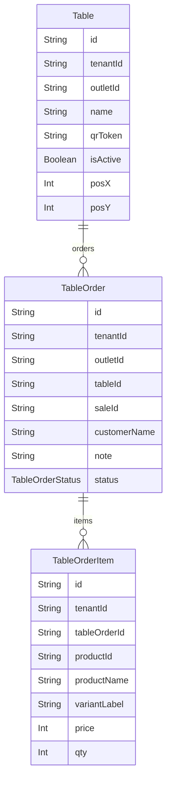

# Domain: PESAN LEWAT QR MEJA

> Digenerate otomatis dari `prisma/schema.prisma` — jangan edit manual, jalankan `npm run knowledge`.

Model: `Table`, `TableOrder`, `TableOrderItem`

## Relasi keluar domain

- `Tenant` → `Table` (`tables`, 1-N)
- `Tenant` → `TableOrder` (`tableOrders`, 1-N)
- `Tenant` → `TableOrderItem` (`tableOrderItems`, 1-N)
- `Outlet` → `Table` (`tables`, 1-N)
- `Outlet` → `TableOrder` (`tableOrders`, 1-N)
- `Product` → `TableOrderItem` (`tableOrderItems`, 1-N)
- `TableOrder` → `Sale` (`tableOrder`, 1-1?)
