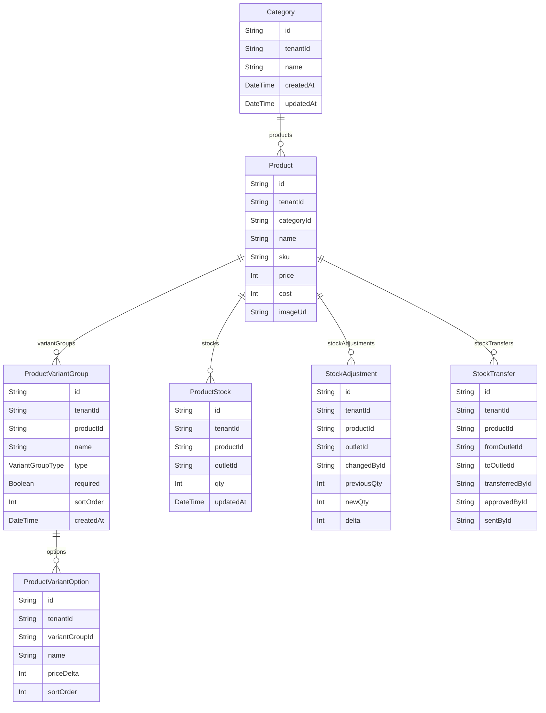

# Domain: PRODUK & STOK

> Digenerate otomatis dari `prisma/schema.prisma` — jangan edit manual, jalankan `npm run knowledge`.

Model: `Category`, `Product`, `ProductVariantGroup`, `ProductVariantOption`, `ProductStock`, `StockAdjustment`, `StockTransfer`

## Relasi keluar domain

- `Tenant` → `Category` (`categories`, 1-N)
- `Tenant` → `Product` (`products`, 1-N)
- `Tenant` → `ProductStock` (`productStocks`, 1-N)
- `Tenant` → `StockAdjustment` (`stockAdjustments`, 1-N)
- `Tenant` → `StockTransfer` (`stockTransfers`, 1-N)
- `Tenant` → `ProductVariantGroup` (`productVariantGroups`, 1-N)
- `Tenant` → `ProductVariantOption` (`productVariantOptions`, 1-N)
- `Outlet` → `ProductStock` (`productStocks`, 1-N)
- `Outlet` → `StockAdjustment` (`stockAdjustments`, 1-N)
- `Outlet` → `StockTransfer` (`transfersFrom`, 1-N)
- `User` → `StockAdjustment` (`stockAdjustments`, 1-N)
- `User` → `StockTransfer` (`stockTransfersCreated`, 1-N)
- `Category` → `Promo` (`promos`, 1-N)
- `Product` → `SaleItem` (`saleItems`, 1-N)
- `Product` → `TableOrderItem` (`tableOrderItems`, 1-N)
- `Product` → `StockReorderPoint` (`reorderPoints`, 1-N)
- `Product` → `StockBatch` (`stockBatches`, 1-N)
- `Product` → `SupplierPricingContract` (`supplierContracts`, 1-N)
- `Product` → `PurchaseOrderItem` (`purchaseOrderItems`, 1-N)
- `Product` → `StockReceiptItem` (`stockReceiptItems`, 1-N)
- `Product` → `StockCountItem` (`stockCountItems`, 1-N)
- `Product` → `ProductCostHistory` (`costHistory`, 1-N)
- `Product` → `ProductUom` (`uoms`, 1-N)
- `Product` → `WholesalePrice` (`wholesalePrices`, 1-N)
- `Product` → `ProductRecipeItem` (`recipes`, 1-N)
