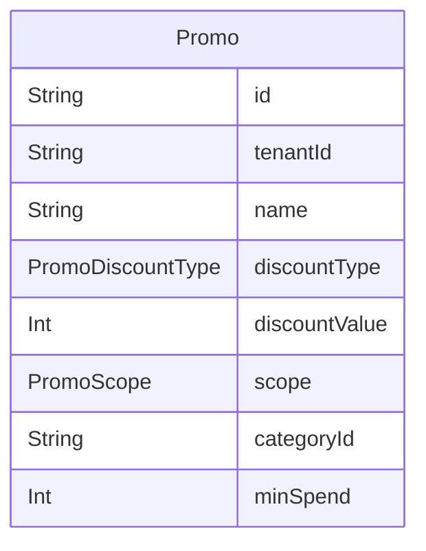

# Domain: PROMO TERJADWAL

> Digenerate otomatis dari `prisma/schema.prisma` — jangan edit manual, jalankan `npm run knowledge`.

Model: `Promo`

## Relasi keluar domain

- `Tenant` → `Promo` (`promos`, 1-N)
- `Category` → `Promo` (`promos`, 1-N)
