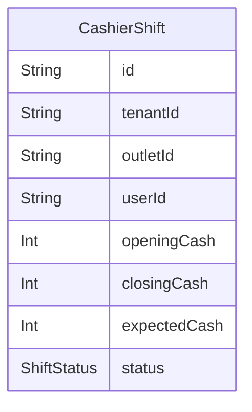

# Domain: SHIFT KASIR

> Digenerate otomatis dari `prisma/schema.prisma` — jangan edit manual, jalankan `npm run knowledge`.

Model: `CashierShift`

## Relasi keluar domain

- `Tenant` → `CashierShift` (`cashierShifts`, 1-N)
- `Outlet` → `CashierShift` (`cashierShifts`, 1-N)
- `User` → `CashierShift` (`cashierShifts`, 1-N)
- `CashierShift` → `Sale` (`sales`, 1-N)
- `CashierShift` → `CashOutTransaction` (`cashOutTransactions`, 1-N)
- `CashierShift` → `SaleReturn` (`saleReturns`, 1-N)
