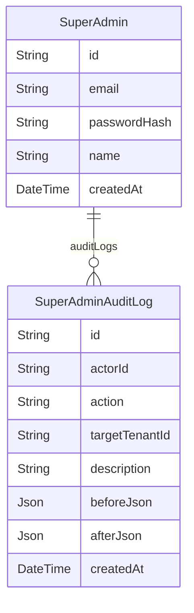

# Domain: SUPER ADMIN (LINTAS TENANT)

> Digenerate otomatis dari `prisma/schema.prisma` — jangan edit manual, jalankan `npm run knowledge`.

Model: `SuperAdmin`, `SuperAdminAuditLog`

```mermaid
erDiagram
  SuperAdmin {
    String id
    String email
    String passwordHash
    String name
    DateTime createdAt
  }
  SuperAdminAuditLog {
    String id
    String actorId
    String action
    String targetTenantId
    String description
    Json beforeJson
    Json afterJson
    DateTime createdAt
  }
  SuperAdmin ||--o{ SuperAdminAuditLog : "auditLogs"
```
