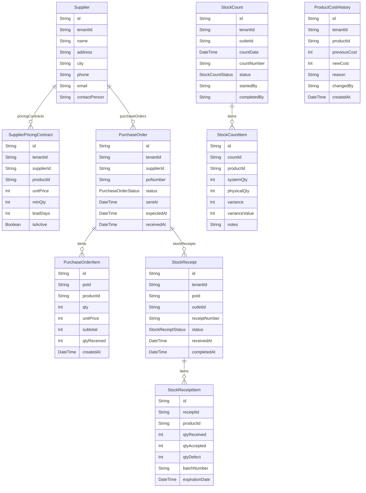

# Domain: SUPPLIER & PURCHASE MANAGEMENT

> Digenerate otomatis dari `prisma/schema.prisma` — jangan edit manual, jalankan `npm run knowledge`.

Model: `Supplier`, `SupplierPricingContract`, `PurchaseOrder`, `PurchaseOrderItem`, `StockReceipt`, `StockReceiptItem`, `StockCount`, `StockCountItem`, `ProductCostHistory`

## Relasi keluar domain

- `Tenant` → `Supplier` (`suppliers`, 1-N)
- `Tenant` → `SupplierPricingContract` (`supplierContracts`, 1-N)
- `Tenant` → `PurchaseOrder` (`purchaseOrders`, 1-N)
- `Tenant` → `StockReceipt` (`stockReceipts`, 1-N)
- `Tenant` → `StockCount` (`stockCounts`, 1-N)
- `Tenant` → `ProductCostHistory` (`productCostHistory`, 1-N)
- `Outlet` → `StockReceipt` (`stockReceipts`, 1-N)
- `Outlet` → `StockCount` (`stockCounts`, 1-N)
- `User` → `PurchaseOrder` (`purchaseOrdersApproved`, 1-N)
- `User` → `StockReceipt` (`stockReceiptsReceived`, 1-N)
- `User` → `StockCount` (`stockCountsStarted`, 1-N)
- `User` → `ProductCostHistory` (`costHistoryChanges`, 1-N)
- `Product` → `SupplierPricingContract` (`supplierContracts`, 1-N)
- `Product` → `PurchaseOrderItem` (`purchaseOrderItems`, 1-N)
- `Product` → `StockReceiptItem` (`stockReceiptItems`, 1-N)
- `Product` → `StockCountItem` (`stockCountItems`, 1-N)
- `Product` → `ProductCostHistory` (`costHistory`, 1-N)
- `Supplier` → `SupplierInvoice` (`invoices`, 1-N)
