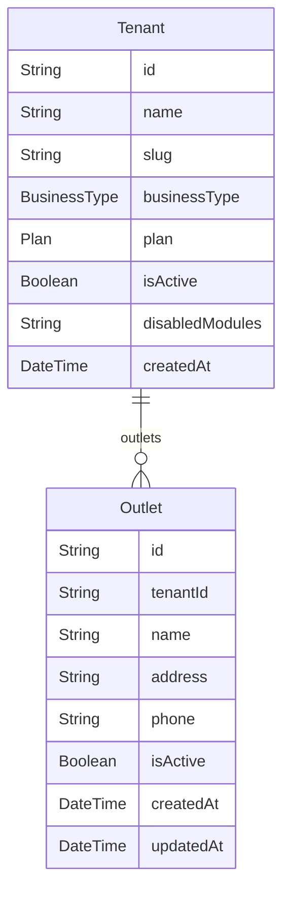

# Domain: TENANT & OUTLET

> Digenerate otomatis dari `prisma/schema.prisma` — jangan edit manual, jalankan `npm run knowledge`.

Model: `Tenant`, `Outlet`

## Relasi keluar domain

- `Tenant` → `User` (`users`, 1-N)
- `Tenant` → `UidBatch` (`uidBatches`, 1-N)
- `Tenant` → `UidCard` (`uidCards`, 1-N)
- `Tenant` → `Member` (`members`, 1-N)
- `Tenant` → `PointTransaction` (`pointTransactions`, 1-N)
- `Tenant` → `Category` (`categories`, 1-N)
- `Tenant` → `Product` (`products`, 1-N)
- `Tenant` → `ProductStock` (`productStocks`, 1-N)
- `Tenant` → `CashierShift` (`cashierShifts`, 1-N)
- `Tenant` → `Sale` (`sales`, 1-N)
- `Tenant` → `CashOutTransaction` (`cashOutTransactions`, 1-N)
- `Tenant` → `SaleItem` (`saleItems`, 1-N)
- `Tenant` → `SaleReturn` (`saleReturns`, 1-N)
- `Tenant` → `SaleReturnItem` (`saleReturnItems`, 1-N)
- `Tenant` → `ShiftSchedule` (`shiftSchedules`, 1-N)
- `Tenant` → `Attendance` (`attendances`, 1-N)
- `Tenant` → `StockAdjustment` (`stockAdjustments`, 1-N)
- `Tenant` → `StockTransfer` (`stockTransfers`, 1-N)
- `Tenant` → `Expense` (`expenses`, 1-N)
- `Tenant` → `Table` (`tables`, 1-N)
- `Tenant` → `TableOrder` (`tableOrders`, 1-N)
- `Tenant` → `TableOrderItem` (`tableOrderItems`, 1-N)
- `Tenant` → `SubscriptionRequest` (`subscriptionRequests`, 1-N)
- `Tenant` → `ProductVariantGroup` (`productVariantGroups`, 1-N)
- `Tenant` → `ProductVariantOption` (`productVariantOptions`, 1-N)
- `Tenant` → `AuditLog` (`auditLogs`, 1-N)
- `Tenant` → `Promo` (`promos`, 1-N)
- `Tenant` → `Booking` (`bookings`, 1-N)
- `Tenant` → `Equipment` (`equipments`, 1-N)
- `Tenant` → `EquipmentMaintenanceLog` (`equipmentMaintenanceLogs`, 1-N)
- `Tenant` → `StockReorderPoint` (`reorderPoints`, 1-N)
- `Tenant` → `StockBatch` (`stockBatches`, 1-N)
- `Tenant` → `WarehouseLocation` (`warehouseLocations`, 1-N)
- `Tenant` → `Supplier` (`suppliers`, 1-N)
- `Tenant` → `SupplierPricingContract` (`supplierContracts`, 1-N)
- `Tenant` → `PurchaseOrder` (`purchaseOrders`, 1-N)
- `Tenant` → `StockReceipt` (`stockReceipts`, 1-N)
- `Tenant` → `StockCount` (`stockCounts`, 1-N)
- `Tenant` → `ProductCostHistory` (`productCostHistory`, 1-N)
- `Tenant` → `Document` (`documents`, 1-N)
- `TenantSetting` → `Tenant` (`setting`, 1-1?)
- `Tenant` → `ProductUom` (`productUoms`, 1-N)
- `Tenant` → `WholesalePrice` (`wholesalePrices`, 1-N)
- `Tenant` → `ProductRecipeItem` (`productRecipeItems`, 1-N)
- `Tenant` → `LaundryOrder` (`laundryOrders`, 1-N)
- `Tenant` → `LaundryService` (`laundryServices`, 1-N)
- `Tenant` → `SupplierInvoice` (`supplierInvoices`, 1-N)
- `Tenant` → `SupplierPayment` (`supplierPayments`, 1-N)
- `Tenant` → `Account` (`accounts`, 1-N)
- `Tenant` → `JournalEntry` (`journalEntries`, 1-N)
- `Tenant` → `Lead` (`leads`, 1-N)
- `Tenant` → `CashFlow` (`cashFlows`, 1-N)
- `Subscription` → `Tenant` (`subscription`, 1-1?)
- `Outlet` → `UserOutlet` (`userOutlets`, 1-N)
- `Outlet` → `ProductStock` (`productStocks`, 1-N)
- `Outlet` → `CashierShift` (`cashierShifts`, 1-N)
- `Outlet` → `Sale` (`sales`, 1-N)
- `Outlet` → `CashOutTransaction` (`cashOutTransactions`, 1-N)
- `Outlet` → `ShiftSchedule` (`shiftSchedules`, 1-N)
- `Outlet` → `Attendance` (`attendances`, 1-N)
- `Outlet` → `StockAdjustment` (`stockAdjustments`, 1-N)
- `Outlet` → `Expense` (`expenses`, 1-N)
- `Outlet` → `StockTransfer` (`transfersFrom`, 1-N)
- `Outlet` → `Table` (`tables`, 1-N)
- `Outlet` → `TableOrder` (`tableOrders`, 1-N)
- `Outlet` → `Booking` (`bookings`, 1-N)
- `Outlet` → `Equipment` (`equipments`, 1-N)
- `Outlet` → `EquipmentMaintenanceLog` (`equipmentMaintenanceLogs`, 1-N)
- `Outlet` → `StockReorderPoint` (`reorderPoints`, 1-N)
- `Outlet` → `StockBatch` (`stockBatches`, 1-N)
- `Outlet` → `WarehouseLocation` (`warehouseLocations`, 1-N)
- `Outlet` → `StockReceipt` (`stockReceipts`, 1-N)
- `Outlet` → `StockCount` (`stockCounts`, 1-N)
- `Outlet` → `LaundryOrder` (`laundryOrders`, 1-N)
- `Outlet` → `CashFlow` (`cashFlows`, 1-N)
