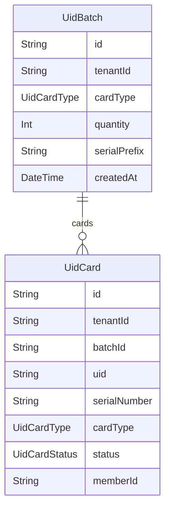

# Domain: UNIVERSAL ID SYSTEM (KARTU QR)

> Digenerate otomatis dari `prisma/schema.prisma` — jangan edit manual, jalankan `npm run knowledge`.

Model: `UidBatch`, `UidCard`

## Relasi keluar domain

- `Tenant` → `UidBatch` (`uidBatches`, 1-N)
- `Tenant` → `UidCard` (`uidCards`, 1-N)
- `User` → `UidCard` (`uidCardsAssigned`, 1-N)
- `Member` → `UidCard` (`member`, 1-1?)
