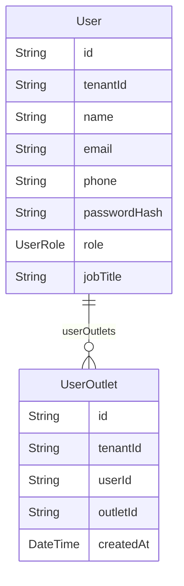

# Domain: USER & AKSES

> Digenerate otomatis dari `prisma/schema.prisma` — jangan edit manual, jalankan `npm run knowledge`.

Model: `User`, `UserOutlet`

## Relasi keluar domain

- `Tenant` → `User` (`users`, 1-N)
- `Outlet` → `UserOutlet` (`userOutlets`, 1-N)
- `User` → `UidCard` (`uidCardsAssigned`, 1-N)
- `User` → `CashierShift` (`cashierShifts`, 1-N)
- `User` → `Sale` (`salesAsCashier`, 1-N)
- `User` → `CashOutTransaction` (`cashOutTransactions`, 1-N)
- `User` → `SaleReturn` (`saleReturnsProcessed`, 1-N)
- `User` → `Attendance` (`attendances`, 1-N)
- `User` → `ShiftSchedule` (`shiftSchedules`, 1-N)
- `User` → `StockAdjustment` (`stockAdjustments`, 1-N)
- `User` → `Expense` (`expensesCreated`, 1-N)
- `User` → `StockTransfer` (`stockTransfersCreated`, 1-N)
- `User` → `AuditLog` (`auditLogs`, 1-N)
- `User` → `Booking` (`bookingsAssigned`, 1-N)
- `User` → `EquipmentMaintenanceLog` (`equipmentMaintenanceLogs`, 1-N)
- `User` → `PurchaseOrder` (`purchaseOrdersApproved`, 1-N)
- `User` → `StockReceipt` (`stockReceiptsReceived`, 1-N)
- `User` → `StockCount` (`stockCountsStarted`, 1-N)
- `User` → `ProductCostHistory` (`costHistoryChanges`, 1-N)
- `User` → `Document` (`documentsUploaded`, 1-N)
- `User` → `DocumentVersion` (`documentVersions`, 1-N)
- `User` → `DocumentSigner` (`documentSignings`, 1-N)
- `User` → `DocumentAccess` (`documentAccess`, 1-N)
- `User` → `LaundryOrder` (`laundryOrdersCreated`, 1-N)
- `User` → `CashFlow` (`cashFlowsCreated`, 1-N)
