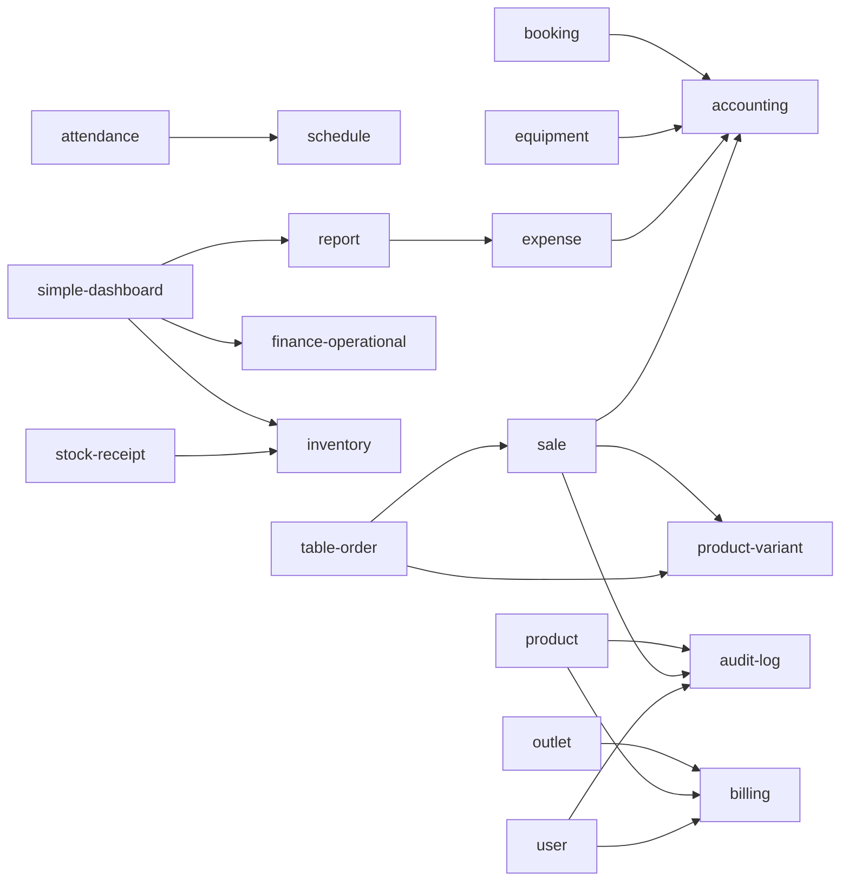

# Relasi Fitur (Service ↔ Service, Halaman → Service)

> Digenerate otomatis dari import statement asli di kode — jangan edit manual, jalankan `npm run knowledge`.

## Service yang saling memakai

Panah A → B artinya service A meng-import service B. Makin banyak panah masuk = makin banyak fitur bergantung padanya.

Service mandiri (tidak import / di-import service lain): `cash-out`, `cashflow`, `dashboard`, `document`, `e-sign`, `finance-analytics`, `hr-analytics`, `kpi`, `laundry`, `lead`, `member`, `pricing`, `promo`, `purchase-order`, `shift`, `stock-count`, `sumopod`, `super-admin`, `supplier`, `table`, `tenant`, `uid-card`

## Halaman mana memakai service apa

| Service | Dipakai halaman |
|---|---|
| `outlet` | /absensi, /absensi/tim, /akun, /alerts, /api/export/laporan, /api/export/transaksi, /booking, /command-center, /finance, /finance/analitik, /finance/kas, /finance/laporan, /finance/metode-bayar, /finance/pengeluaran, /hris, /inventory, /inventory/transfer-stok, /kasir, /kasir/riwayat, /kpi, /kpi/analitik, /laundry, /maintenance, /pengaturan/karyawan, /pengaturan/meja, /pengaturan/outlet, /pesanan-meja, /produk/transfer-stok, /simple/data, /simple/hari-ini, /simple/uang, /stock-count, /stock-receipt, /tim |
| `product` | /inventory, /inventory/riwayat-stok, /inventory/transfer-stok, /kasir, /pengaturan/promo, /pesan/[qrToken], /produk, /produk/label-barcode, /produk/riwayat-stok, /produk/transfer-stok, /purchase-order, /stock-receipt |
| `user` | /absensi/tim, /akun, /booking, /dokumen, /hris, /pengaturan/karyawan, /tim |
| `tenant` | /, /kpi, /pengaturan/bisnis, /pilih-aplikasi, /register, /superadmin/ |
| `table` | /command-center, /pengaturan/meja, /pengaturan/meja/[tableId], /pesan/[qrToken], /pesanan-meja |
| `inventory` | /command-center, /inventory, /kpi, /produk, /simple/data |
| `report` | /api/export/laporan, /finance, /finance/analitik, /finance/laporan, /simple/data |
| `finance-operational` | /finance, /finance/hutang-supplier, /finance/kas, /finance/metode-bayar, /simple/uang |
| `member` | /api/members, /api/members/search, /member, /member/[id], /q/[uid] |
| `super-admin` | /superadmin/, /superadmin/admins, /superadmin/audit-logs, /superadmin/login, /superadmin/tenant/[id] |
| `attendance` | /absensi, /absensi/tim, /hris, /tim |
| `schedule` | /absensi, /absensi/tim, /hris, /tim |
| `shift` | /kasir, /kasir/tutup, /kasir/tutup/selesai/[shiftId], /pesanan-meja |
| `sale` | /api/export/transaksi, /kasir, /kasir/riwayat, /kasir/struk/[saleId] |
| `uid-card` | /member/[id], /pengaturan/kartu, /pengaturan/kartu/[batchId], /q/[uid] |
| `billing` | /api/webhook/sumopod, /billing, /pengaturan/langganan |
| `table-order` | /command-center, /pesan/[qrToken], /pesanan-meja |
| `supplier` | /purchase-order, /stock-receipt, /supplier |
| `simple-dashboard` | /alerts, /simple/hari-ini |
| `document` | /dokumen, /dokumen/[id] |
| `finance-analytics` | /finance/analitik, /finance/laba-rugi |
| `cashflow` | /finance/kas, /simple/uang |
| `expense` | /finance/pengeluaran, /pengeluaran |
| `product-variant` | /inventory, /produk |
| `cash-out` | /kasir, /kasir/riwayat |
| `promo` | /kasir, /pengaturan/promo |
| `laundry` | /laundry, /pengaturan/laundry |
| `purchase-order` | /purchase-order, /stock-receipt |
| `booking` | /booking |
| `lead` | /crm |
| `e-sign` | /dokumen |
| `kpi` | /kpi/analitik |
| `dashboard` | /kpi |
| `equipment` | /maintenance |
| `audit-log` | /pengaturan/audit-log |
| `stock-count` | /stock-count |
| `stock-receipt` | /stock-receipt |
| `hr-analytics` | /tim/analitik |
| `sumopod` | /api/webhook/sumopod |
