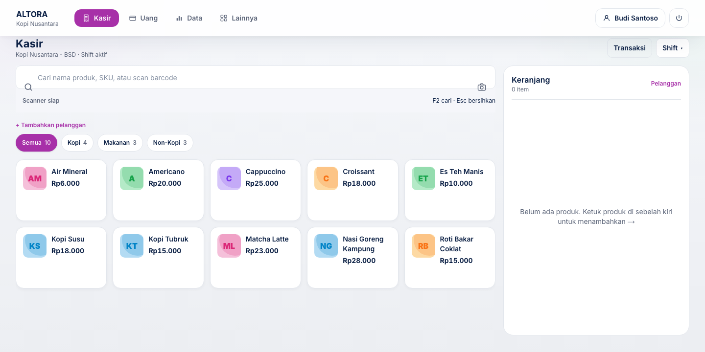
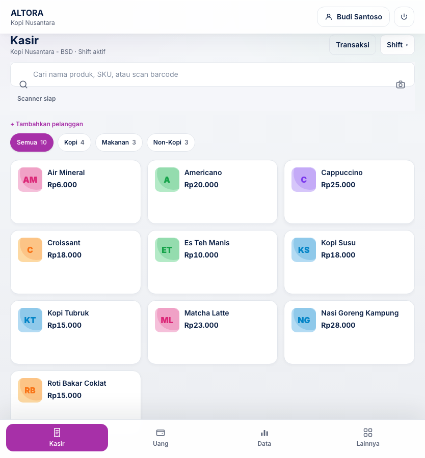
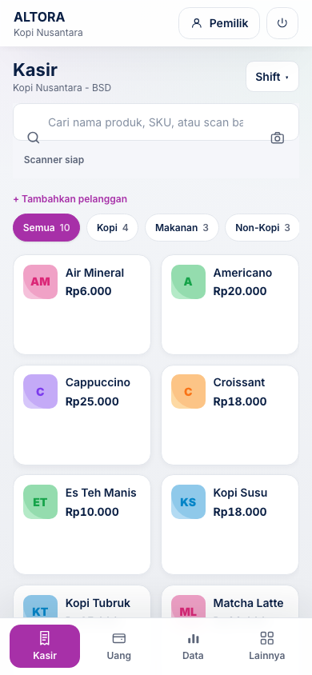

# Panduan Pengguna Altora

Panduan ini untuk Owner, Manager, dan Staff pada Altora Cafe, Toko, Laundry,
Counter, Barbershop, dan Company.

- [Panduan operasional lengkap](./PANDUAN-OPERASIONAL.md)
- [Unduh panduan pengguna (PDF)](./Altora-Panduan-Pengguna.pdf)
- [Unduh panduan pengguna (Word)](./Altora-Panduan-Pengguna.docx)
- [Dokumentasi teknis dan data](../knowledge/README.md)
- [Rencana rilis dan hardening](../audit/PRODUCTION-ROLLOUT.md)

## Peta cepat

| Kebutuhan | Menu |
| --- | --- |
| Menjual produk atau jasa | `Kasir` |
| Riwayat, void, retur, struk | `Kasir → Riwayat` |
| Produk, barcode, stok, serial | `Produk` atau `Inventory` |
| Supplier, PO, barang datang | `Supplier`, `Purchase Order`, `Barang Masuk` |
| Pindah/hitung stok | `Transfer Stok`, `Stock Count` |
| Member, poin, deposit, voucher | `Member`, `Voucher` |
| Absensi, jadwal, target | `Tim` atau `Absensi` |
| Uang, pengeluaran, laporan | `Uang`, `Laporan`, atau `Finance` |
| Outlet, meja, promo, staf | `Pengaturan` |

Fitur hanya terlihat bila modul dan akses peran mengizinkannya.

## Screenshot Kasir

Screenshot ini memakai data demo `Kopi Nusantara` di lingkungan audit terisolasi.
Tidak menggunakan akun, transaksi, atau data tenant production.

| Desktop | Tablet | Mobile |
| --- | --- | --- |
|  |  |  |
